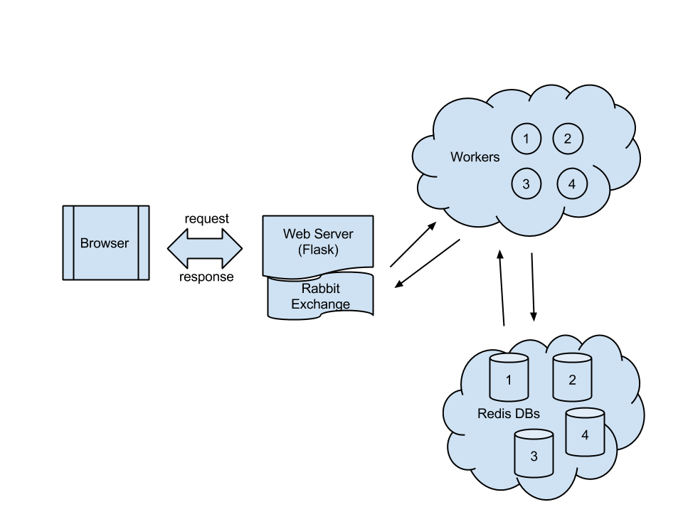

# Congress in the Cloud
**Michael Coughlin and Michael Skirpan**

The Congressional Dataset which includes all of the Congressional Record (i.e., words spoken on the floor), Sub-Committee Hearings, and Votes is a massive and continually-growing set of words that is difficult to access for the common voter.  Currently the only place on the web where Congressional data is stored in an indexable and searchable format is on the [Sunlight Foundation's Web API](http://sunlightfoundation.com/).  While Sunlight's project is a step forward, it is still mostly accessible for those computer savvy enough to work with REST APIs.  Our project was aimed at building a cloud infrastructure that would establish the foundation of what is needed to support a web-based search engine allowing end-users the ability to search through congressional records and, eventually, perform analytic work on subsets of the record.

## Project Goals

The larger objective of this project will take a lot of front-end design and algorithm implementation to support optimized search functionality and natural language processing.  However, for this class our goal was to learn about building distributed systems in the cloud in order to get the working parts of such a project going.  Aspects we focused on were:

* Automated configuration of nodes in the cloud
* Distributed data stores
* Basic publish-subscribe systems
* Crawling and data ingestion
* Using Remote Procedure Calls (RPC) to develop scalable response patterns

Our first goal was to write an automated procedure for building out worker, data, and web server nodes.  Application setup is always one of the most time consuming tasks in any distributed system.  Thus, we wanted to learn how to simplify and streamline this process as much as possible.  

Next, we wanted to iterate over different options for a distributed data store.  Specifically, we wanted a NoSQL database and were hoping to decide between Cassandra, Riak, and Redis.  Once we had a database configured, we planned to write a crawler to pull down our data, parse it, and fill the databases.  

Finally we hoped to use a publisher-subscriber system to handle communication between nodes.  Given that our final aim was to be able to open up this resource to end-users for the purpose of applying more complicated algorithms, we planned to design our pub-sub system so as to learn about RPC.

## Description of Process
Initially, there was some difficulty determining the network topology and basic functionality of our system.  In particular, after deliberating on the basic infrastructure, we had three primary questions on which to decide:

1. Do we put pub-sub exchanges between both the data and worker and the web server and worker?
2. Should we allow the web server's node to also host the pub-sub exchange?
3. Do we ingest our data with a script on the worker node or handle novel data ingestion from the web server?

After some consideration, we decided that (1) and (3) were questions that needed to be answered coextensively.  We only really needed the extra pub-sub exchange in (1) if we were going to handle both ingestion and query tasks at the level of the web server.  In this case, we would've needed the extra exchange in order to allow certain data nodes to be subscribed to new information being pushed while mirrors of those databases could have taken care of query responses.  

Given that the Congressional Record has a single, centralized outpost, we deemed it unnecessary to allow users to provide us with data since we can easily keep up to date with any new data posted by the federal government.  As for (2), we chose to keep the pub-sub exchange on the same node as the web server in order to avoid the problem of our exchange going down but the Web Server still taking requests.

<!--
#[Michael can describe the process of using Puppet here]
-->
###Cloud Deployment
In order to deploy our application, we needed a cluster of different servers for hosting our services and potentially supporting scaling of the application, which suggested the use of a cloud infrastructure. Our original plan was to develop the cluster using OpenStack and then migrate to EC2, which led us to choose ubiquitous technologies that are generally supported by many cloud providers. For this reason, we chose an Ubuntu server, Puppet, and Cloud-init as our platform technologies, as they are supported by both OpenStack and Amazon EC2. An added benefit to using these technologies is that our application can be distributed as a set of Puppet and Cloud-init configuration files with small programs that can deploy the application on different providers.

By using Cloud-init and Puppet, our entire cluster can be stood up using a single shell script that communicates with OpenStack using the Nova Python API. By making use of the user-data file that can be provided to Cloud-init, we are able to provide a complete compressed Puppet configuration for the cluster, a Python handler to decompress the configuration and a command to instruct Cloud-init to install Puppet and apply the configuration. Traditionally, Puppet configurations are applied using a central Puppet master server, but by providing the configuration directly to each node, the cluster can be created without the need for any existing structure, such as a master server in the cluster. In our Puppet configuration, we install all necessary servers onto the specific nodes, such as Redis on the database nodes or RabbitMQ on the web server node, and launch these services as soon as the nodes are available. This allows us to be able to create the entire cluster and application using a single command while having the flexibility to change the cluster configuration in a single location, without having to access the nodes directly.

###Database
In choosing a database, we started by looking into Cassandra, but quickly realized this was much too large of a system for our needs.  We didn't really need JSON-like blobs and instead just needed a way to look up documents.  Then we moved on to reading into Riak, which is supposed to be built for large, distributed systems.  However, we found that the configuration of Riak, was more than we wanted to commit to this portion of project.  Thus, in the end we chose Redis due to the simplicity of configuring the server, setting up mirroring, and a well supported Python API.  

###Web Crawler
One of the biggest challenges we faced was getting the crawler, parsing, and indexing working correctly.  At first, we wrote a simple web scraper using [Tornado](http://www.tornadoweb.org/en/stable/).  This worked fine, but then we got bogged down trying to get the parsing right.  In the end, we found that Sunlight Foundation had already written a parser that converted Congressional Documents to marked-up XML.  Since their tools are open source, we decided to attach their parser to our crawler, which is now implemented in Flask.

## Technology Used
The final topography, including technology used can be seen in the figure below:\

This topology has separate clusters for the worker and database nodes, and a single node to host the web server and RabbitMQ server. As detailed above, we used Redis as our database, RabbitMQ as our pub/sub system and Puppet and Cloud-init for our deployment and management systems.

## Findings and Lessons Learned
We learned several lessons when working with this technology, especially in how to use these various open source cloud projects. One of the key lessons we learned was that even though many of these projects are supposed to have superior features, the one that is easier to deploy is often better for the project.  Tools seem to be split into two categories of utility: 1) quickly prototyping an application for proof of concept and 2) maintaining a mature project at production scale.  In the early phase of a project, you want things that work out of the box as you are still learning your problem space and facing high-level design challenges.  Later on, once the project is established, you want find highly configurable platforms that can fit final specifications.

Another lesson we learned is that these cloud infrastructures have many automated features, such as Cloud-init, that are very powerful if properly configured, but require a lot of time at first and need many extensions and plugins to be dynamic.  Right now this seems to be a big space for improvement in the cloud computing world: quick deployment of clusters and services with extensible features.  Docker is making headway in solving this problem, but is still missing basic network and VM maintenance that are available in Puppet and Cloud-Init.

Finally, we realized that there is a big difference between making datasets available for people and curating them for analysis.  Web scraping has become a simple task with many options from Apache Nutch to Python's Beautiful Soup or LXML libraries.  Thus obtaining big datasets is not so hard; however, writing the scripts to parse and index data so as to prepare it for many types of analysis is quite hard.  This helps in understanding why many web APIs and open data projects do not open up services for server-side analysis.  Doing this can be take more time than creating the rest of your project's infrastructure.

## Future Implementations
There a number of features that we would like to implement in future versions of this project. Some of these features were omitted due to time constraints, others were brainstormed during the development of the project but deemed unnecessary at implementation, and a few were outside the scope of this particular project.  A list of these features are:

* Elastic load balancing of requests and work to the workers
* Asynchronous handling of time-intensive tasks
* Increased performance and fault tolerance of the system, such as using mirrored copies of the Redis database
* Evaluation of acknowledgments for the pub/sub system
* Evaluation of the functionality/usability trade off between different pub/sub systems such as comparing our RabbitMQ and Redis system to NSQ, ZeroMQ or Kafka with a Riak or Cassandra database.
* Migration to other cloud services, such as EC2 or Digital Ocean, and provide support for different providers using a common configuration
* Create a web front end for the application to make it easily accessible

## Conclusion

In the end, we successfully downloaded, parsed, indexed, and stored three years of the Congressional Record on a mirrored Redis server.  We used an RPC implementation of a queueing system on a RabbitMQ exchange and a Flask web server to handle API routes for searching the data by name (surname of Congressman or woman), document title, or date.  The queue used unique identifiers to bind requests with work in the queue and the workers would push full documents, concatenated into a list back to the callers waiting on the web server.  

With the whole system working at the most basic level, the immediate next steps would be a web front-end and more database nodes to handle more of the Congressional Record.  We now feel we have a sense for some of the foundational issues faced when setting up a distributed system in the cloud and plan to continue working on this project to support more features in the future.  A full implementation of this system, ready for production, would definitely include a more robust messaging system and load balancing.  Once we see the feasibility of the project upon adding features, it'll be interesting to reanalyze our work and determine next steps.
